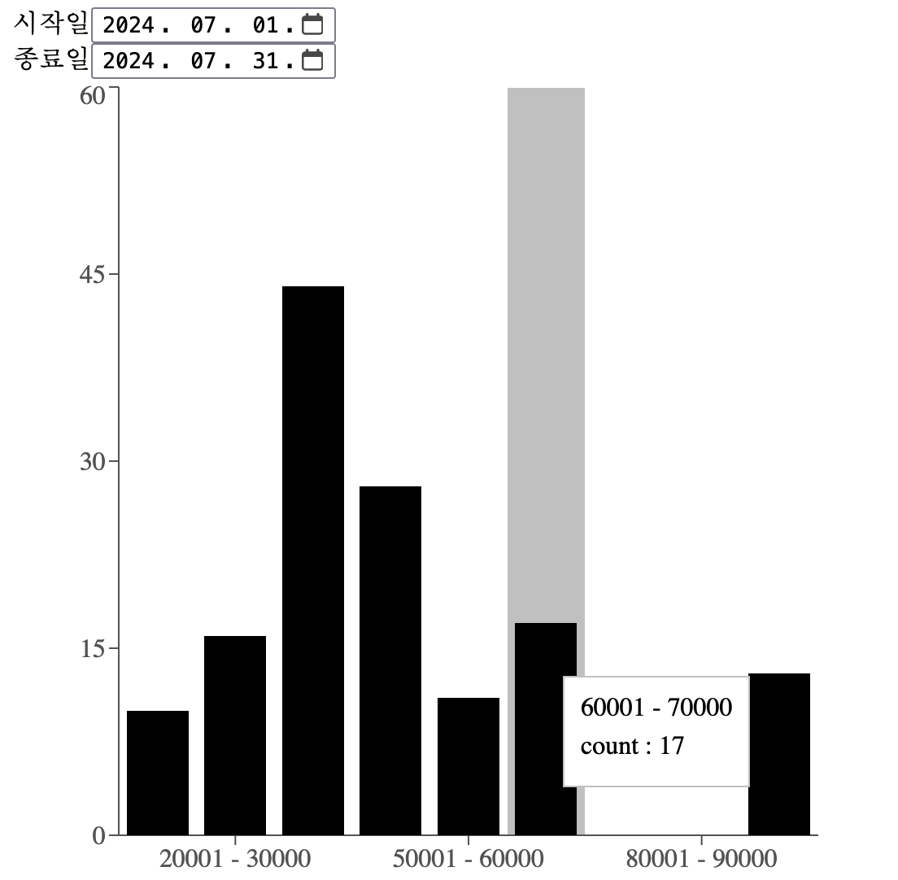
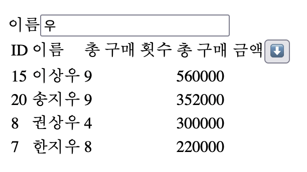
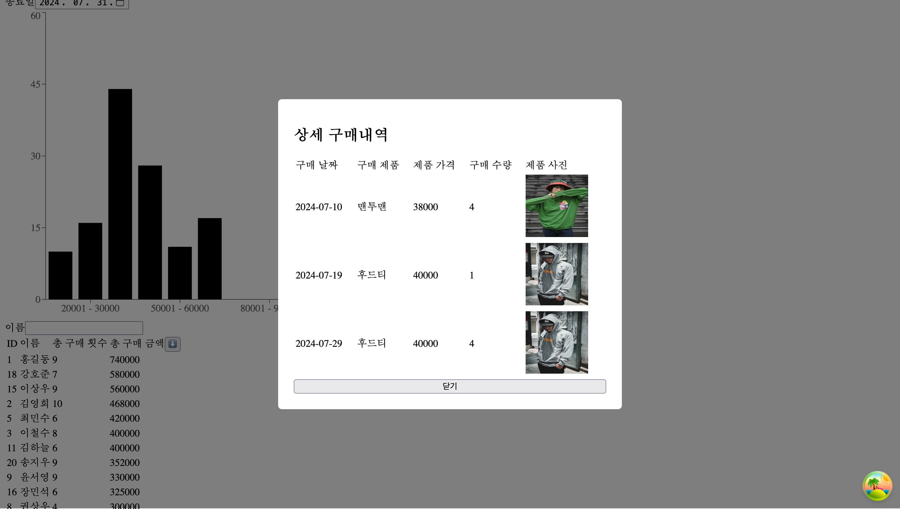

# Datarize Frontend 과제 전형

## 프로젝트 설정

프로젝트의 핵심 구조는 다음과 같습니다.

```
- src/
  - apis/                       // API 호출 인터페이스
    - queryClient.ts
    - queryKeys.ts
    - useCustomerPurchases.ts   // api/customers/${id}/purchases
    - useCustomers.ts           // api/customers
    - usePurchaseFrequency.ts   // api/purchase-frequency
  - components/                 // 기능별 컴포넌트
    - CustomerPurchases/        // 고객 ID 기반 상세 기능
    - Customers/                // 가장 많이 구매한 고객 목록 및 검색 기능
    - PurchaseFrequency/        // 가격대별 구매 빈도 차트
  - interfaces/                 // 재사용되는 타입 정의
  - App.tsx                     // 컴포넌트 배치
  - main.tsx                    // 서비스 기본 설정
```

### import 경로 alias

import 경로를 간소화하고자 `tsconfig`의 `paths` 옵션을 사용했습니다. 상대경로를 alias로 대체체할 수 있습니다.

(예: `./src/components/Customers` -> `@components/Customers`)

`vite-tsconfig-paths` 패키지를 사용해 `vite`에 간단히 적용할 수 있었습니다.

### axios와 .env 환경변수

API 호출은 `react-query`로 제어되지만 직접적인 호출은 `axios`로 실행합니다.

실행환경별 서비스 백엔드 주소를 `.env` 환경변수로 관리하고, `src/main.tsx`에서 아래 코드를 통해 `axios`의 `baseURL`을 제어합니다.

```typescript
import axios from 'axios';

// axios 기본 URL 설정
axios.defaults.baseURL = import.meta.env.VITE_SERVER_URL;
```

과제는 로컬에서 실행된다고 가정해서 `.env.development.local`에 환경변수를 정의했습니다.

## 프로젝트 실행 방법

아래 명령어를 차례로 실행합니다.

```bash
cd apps
yarn install
yarn start-server
yarn start-client
```

## 과제 설명

### (공통) 서비스 백엔드 호출

> (요구사항) 데이터는 클라이언트 사이드에서 비동기 요청을 통해 가져와야 합니다. 모든 데이터 요청에 대한 로딩 상태와 에러 처리를 구현하세요.

모든 API 요청은 `react-query`와 `axio`를 사용해 비동기 요청으로 처리됩니다. 또한 `<Suspense>`와 `<ErrorBoundary>`로 감싸져서 기본적인 로딩과 에러 fallback을 지원합니다.

여기에 `useDeferredValue`를 사용해 로딩 중 사용성을 개선했습니다.

특수한 경우, 예를 들어 `/api/customers?name={이름}`은 검색조건에 해당하는 결과가 없을 경우 404 오류를 반환하는데, 이 경우에는 `검색 결과가 없습니다.`라고 표시하는 식으로 예외 처리를 구현했습니다.

### 가격대별 구매 빈도 차트



`시작일`과 `종료일`을 `<input type="date">`로 선택합니다. 

초기값은 각각 `2024-07-01`과 `2024-07-31`입니다. `2024년 7월` 한달 동안 구매 데이터를 조회하는 것이 목적이므로 이렇게 설정했습니다.

`시작일`과 `종료일`을 변경했을 때 유효성을 검사합니다. (1) `시작일`이 `종료일`보다 빠르거나 동일하고, (2) `시작일`과 `종료일`이 `2024년 7월`에 포함된다면 유효하다고 판단하고 `/api/purchase-frequency?from={시작일}&to={종료일}`를 호출했습니다. 유효하지 않다면 값을 변경하지 않습니다.

날짜는 `dayjs`를 사용해 ISO 8601 형식으로 변환했습니다. 타임존에 따라서 조회 데이터가 다를 수 있으므로 UTC+0을 기준으로 설정했습니다.

조회된 데이터는 `recharts`를 사용해 바 차트로 표현했습니다.

> (경계값 문제) 요구사항에는 `가격대는 2만원 이하부터 10만원 이상까지 만원 단위로 구분됩니다.`라는 표현이 들어가 있습니다. 하지만 API 결과는 `0~20000, 20001~30000, ..., 90001~100000`으로 `10만 원 이상`을 표현할 수 없는 문제가 있습니다.
> 
> 우선 상품 가격이 최대 100,000원으로 확인돼 조회 결과를 그대로 표시했습니다.

> (백엔드 수정) `/api/purchase-frequency`는 의도적으로 오류를 반환하도록 구현되어 있습니다. 아래 코드를 주석 처리해서 문제를 해결했습니다.

```typescript
// apps/backend/src/routes/purchaseFrequency.ts

if (Math.random() <= 1) {
  throw new Error('Intentional error occurred')
}
```

### 가장 많이 구매한 고객 목록 및 검색 기능



`이름`이 포함된 모든 고객을 `총 구매 금액`을 기준으로 정렬하여 표시합니다.

`이름`을 변경하면 디바운스를 거쳐 약간의 지연시간 이후 검색을 실행합니다.

`총 구매 금액` 옆 정렬 버튼을 클릭해서 오름차순/내림차순을 바꿀 수 있습니다. 초기값은 내림차순입니다.

### 고객 ID 기반 상세 기능



`가장 많이 구매한 고객 목록 및 검색 기능`에 통합해 구현했습니다. 고객의 row를 선택하면 바로 아래에 해당 고객의 상세 구매 내역을 표시합니다.

검색 결과는 `구매 날짜`, `구매 제품`, `제품 가격`, `구매 수량`, `제품 사진`으로 구성됩니다.

`/api/customers/{id}/purchases`는 `제품 가격` 대신 `총 구매 가격`을 반환하므로 별도로 계산이 필요했습니다.

> (백엔드 수정) 요구사항에는 `/api/customer/{id}/purchases`로 되어 있지만 `/api/customers/{id}/purchases`가 올바른 접근 경로입니다.